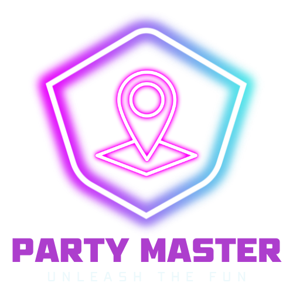
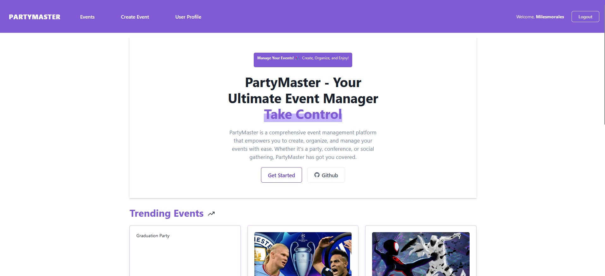
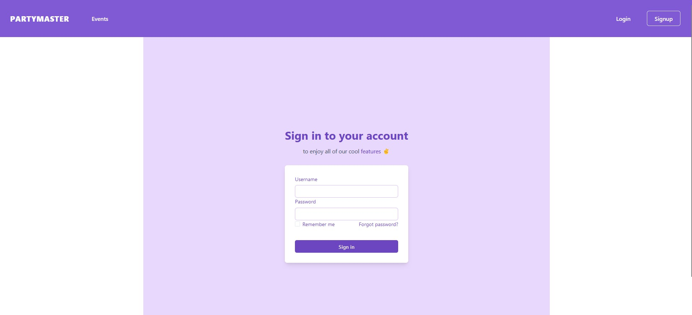
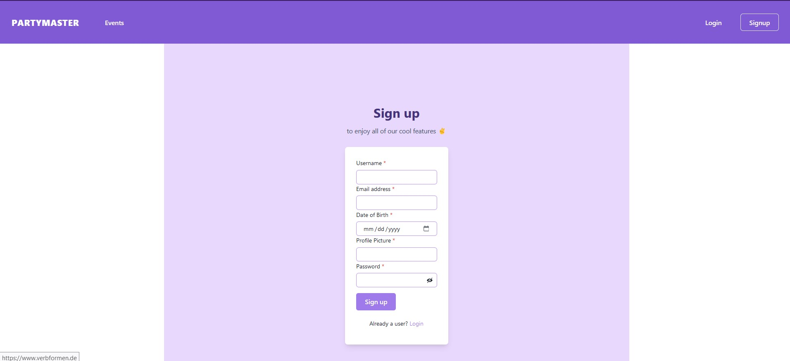
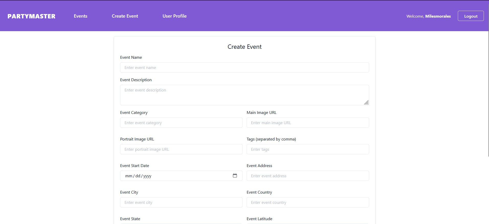
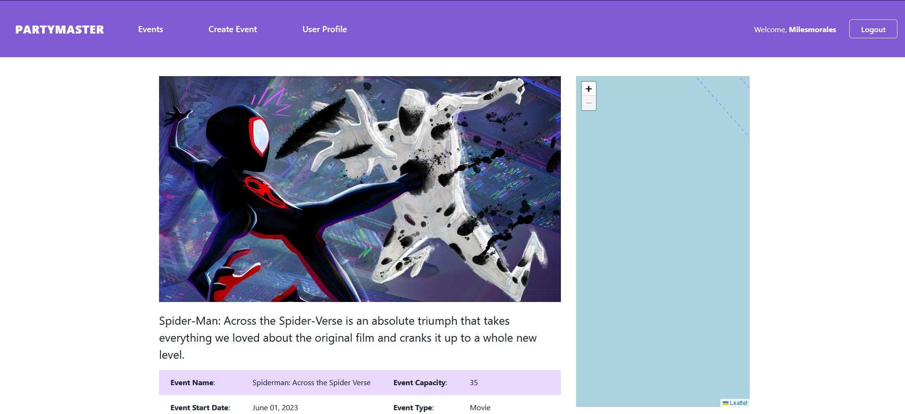

<!-- PROJECT LOGO -->
<a href="LICENSE" target="_blank">
    
</a>
<br />
<div align="center">
  <a href="https://github.com/RaulMaya/PartyMaster">
    
  </a>

  <h4 align="center">MERN App</h4>

<br/>
<p align="center">
    <a href="https://www.mongodb.com/" target="_blank">
        
    </a>
    <a href="https://expressjs.com/" target="_blank">
        
    </a>
        <a href="https://react.dev/" target="_blank">
        
    </a>
    <a href="https://nodejs.org/en/docs/" target="_blank">
        
    </a>
</p>
<br/>

<p align="center">
We envisioned an app that simplifies event discovery, creation, and sharing. To fulfill this vision, we developed this project. With our app, users can effortlessly generate, modify, invite, confirm, comment on, and stay informed about upcoming events.
    <br />
    <br />
    <a href="https://github.com/RaulMaya/PartyMaster">Repository</a>    
    ·
    <a href="https://fierce-sea-32319.herokuapp.com/">Deployment</a>
    ·
    <a href="https://www.linkedin.com/in/raul-maya/">My LinkedIn</a>

  </p>
</div>

### Content Table

- [About](#about)
- [Usage](#usage)
- [Installation](#installation)
- [Interface](#interface)
- [Deployment](#deployment)
- [License](#license)
- [Contact](#contact)

<br>

### About

<p>Introducing our MERN-based app with GraphQL integration! Designed to revolutionize event management, our platform simplifies the process of discovering, creating, and sharing events. With seamless integration of resolvers, deftypes, and mutations, our app empowers users to effortlessly generate and modify events according to their preferences. Stay connected with friends and the community as you invite, confirm, and comment on upcoming events. Our intuitive interface ensures that users are always informed and engaged with the latest happenings. Experience the ease and convenience of event planning with our innovative app.</p>

<br>

### Usage

<p>The usage of our app is straightforward and user-friendly. Upon launching the app, users are greeted with a visually appealing interface that showcases upcoming events. To discover events, users can browse through various categories or use the search functionality to find specific types of events.

For those who want to create their own events, our app offers a seamless experience. By selecting the "Create Event" option, users are guided through a step-by-step process where they can provide event details such as the title, date, time, location, and description. They can also add relevant tags and upload images to make their event more enticing.

Once an event is created, users have full control over it. They can easily modify event details, such as changing the date or updating the description. Inviting friends to the event is as simple as selecting contacts from their address book or sharing the event's unique link.

When it comes to event participation, our app allows users to confirm their attendance with just a few taps. They can also leave comments and engage in discussions with other attendees, creating a vibrant community around each event.

To ensure users stay informed, our app provides real-time updates and notifications about upcoming events they are interested in. Whether it's a reminder about an event they confirmed or a new comment on an event they're following, users will always be in the loop.

In summary, our app streamlines event discovery, creation, and sharing processes, empowering users to effortlessly manage their events and stay connected with friends and the community.</p>

<br>

### Installation

```
git clone git@github.com:RaulMaya/PartyMaster.git
npm i
npm run develop
```

<br>

### Interface

1. Landing:

 
2. Login In:


3. Sign Up:


4. Create Event:

5. Single Event:


<br>

### Deployment

<a href="https://fierce-sea-32319.herokuapp.com/">

</a>
 
<br>

### License

> You can check out the full license [here](https://github.com/RaulMaya/PartyMaster/blob/master/LICENSE)
> This project is licensed under the terms of the **MIT** license.

<br>

### Contact

- Name: Raul Maya Salazar
- Phone: +52 833 159 7006
- E-mail: raulmayas20@gmail.com
- GitHub: https://github.com/RaulMaya
- LinkedIn: https://www.linkedin.com/in/raul-maya/

<p align="right">(<a href="#top">back to top</a>)</p>
