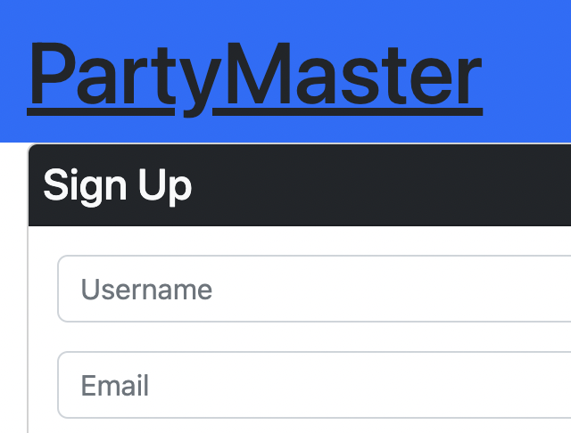
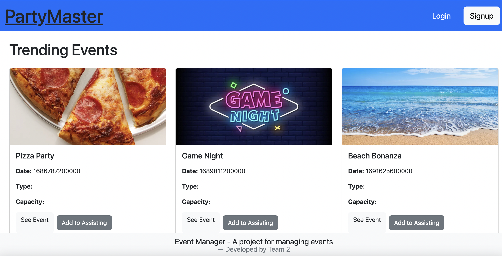

# <Event-Manager>

## Description

Our motivation.
We wanted an app that helps us find incoming events. As well as creating our own and sharing it with friends. So we created this project this project to fill that need.

Now users can easily create, invite, and inform themselves about incoming events.

## Table of Contents

- [Installation](#installation)
- [Usage](#usage)
- [Credits](#credits)
- [License](#license)

## Installation

To run GraphQL: in your terminal: npm i, npm run seed, npm run start.

To run React: in your terminal: npm i, npm run build, npm run seed, npm run develop.

## Usage
1.- Provide the info you want in your sign up. Then you can log in at any time.

2.- Enjoy

Provide information and sign up to be able to use the app.

## Credits

Team of Full Stack Web Developers

David Dominguez: https://github.com/Drums180

Raul Maya: https://github.com/RaulMaya

Samuel Russek: https://github.com/SamRF13

## Features

TBA

## License

MIT License

Copyright (c) [2023] [Raul Maya]

Permission is hereby granted, free of charge, to any person obtaining a copy
of this software and associated documentation files (the "Software"), to deal
in the Software without restriction, including without limitation the rights
to use, copy, modify, merge, publish, distribute, sublicense, and/or sell
copies of the Software, and to permit persons to whom the Software is
furnished to do so, subject to the following conditions:

The above copyright notice and this permission notice shall be included in all
copies or substantial portions of the Software.

THE SOFTWARE IS PROVIDED "AS IS", WITHOUT WARRANTY OF ANY KIND, EXPRESS OR
IMPLIED, INCLUDING BUT NOT LIMITED TO THE WARRANTIES OF MERCHANTABILITY,
FITNESS FOR A PARTICULAR PURPOSE AND NONINFRINGEMENT. IN NO EVENT SHALL THE
AUTHORS OR COPYRIGHT HOLDERS BE LIABLE FOR ANY CLAIM, DAMAGES OR OTHER
LIABILITY, WHETHER IN AN ACTION OF CONTRACT, TORT OR OTHERWISE, ARISING FROM,
OUT OF OR IN CONNECTION WITH THE SOFTWARE OR THE USE OR OTHER DEALINGS IN THE
SOFTWARE.
